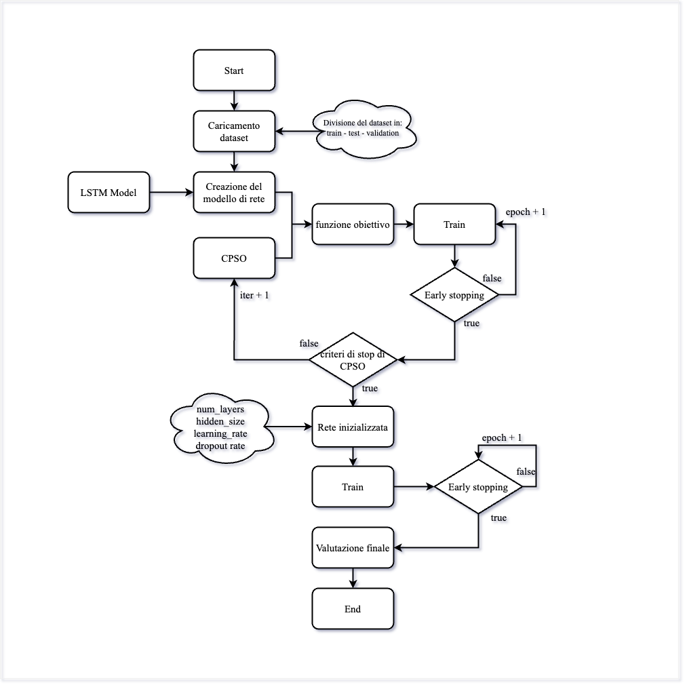

# 💧 WATER 4.0 – Predizione delle Perdite Idriche

WATER 4.0 è un progetto di ricerca orientato alla previsione delle perdite idriche in reti di distribuzione, mediante una pipeline che integra:

- Un **modello generativo GAN** per la simulazione di scenari plausibili di variabili idrauliche.
- Un modello **LSTM** per la stima della perdita idrica associata a ciascuno scenario.
- Un’ottimizzazione numerica tramite **Continuous Particle Swarm Optimization (CPSO)** per il tuning della LSTM.

---

## 📌 Obiettivo del Progetto

Predire in modo accurato e continuo la quantità di **acqua persa (m³/h)** nella rete idrica, sfruttando **scenari simulati multivariati** (pressioni, flussi, domande, livelli) generati da una **GAN condizionata**.

L'approccio si articola in due fasi:

1. **Generazione di scenari realistici** tramite una rete **Generative Adversarial Network**.
2. **Predizione della perdita** su ciascuno scenario tramite una rete **LSTM ottimizzata**.

---

## 🧠 Architettura della Soluzione

### Generazione degli Scenari con GAN

- È stato addestrato un **modello GAN condizionato** per simulare variabili idrauliche multivariate coerenti con i dati storici reali.
- Lo scopo è **espandere artificialmente il dataset** con scenari realistici e stocastici.
- Gli scenari prodotti hanno la forma `(N_scenari, forecast_horizon, n_features)` e sono salvati come input per la LSTM.

### Predizione con LSTM

- Una rete **LSTM bidirezionale con meccanismo di attenzione** viene impiegata per mappare ciascuno scenario generato in una previsione puntuale di leakage.
- L'output finale è un valore continuo che rappresenta la **perdita idrica aggregata prevista per scenario**.
- La rete è stata ottimizzata tramite **CPSO** su iperparametri chiave (numero layer, neuroni, learning rate, dropout).

---

## 📊 Vantaggi dell'approccio GAN + LSTM

- **Aumento virtuale dei dati (Data Augmentation)** senza necessità di simulazioni idrauliche computazionalmente costose.
- **Stima probabilistica** della perdita idrica tramite simulazione di molteplici scenari e analisi della distribuzione delle predizioni.
- **Separazione chiara dei compiti**:
  - La GAN genera il "futuro possibile".
  - La LSTM valuta il rischio (leakage) associato a ciascuna possibilità.
- **Flessibilità e scalabilità** verso scenari reali, anche in condizioni di scarsità di dati osservati.

---

## Modello Predittivo LSTM

### Architettura

- **LSTM bidirezionale** con 2 layer.
- **Dropout e BatchNorm** per regolarizzazione.
- **Meccanismo di attenzione** per pesare temporalmente le informazioni più rilevanti.
- **Fully connected finale** per output continuo.

L’input è un tensore sequenziale (`(T, n_features)`) mediato su più simulazioni dello stesso scenario. L’output è un **valore continuo** corrispondente alla perdita prevista.

---

## Ottimizzazione con Continuous CPSO

Il tuning della rete LSTM è effettuato tramite **CPSO**, in grado di:

- Esplorare in modo efficiente lo spazio continuo degli iperparametri.
- Adattare dinamicamente i parametri dello sciame.
- Evitare minimi locali e migliorare la generalizzazione rispetto al tuning tradizionale.

---

## Dataset: BattLeDIM 2020

Il dataset utilizzato proviene dalla competizione internazionale **BattLeDIM 2020**, ed è basato su simulazioni realistiche della rete idrica virtuale **L-Town**.

### Variabili disponibili:

1. **Domande (Demands)** – 82 nodi (l/h)
2. **Flussi (Flows)** – 3 sensori (m³/h)
3. **Pressioni (Pressures)** – 33 sensori (m)
4. **Livelli (Levels)** – 1 serbatoio (m)
5. **Perdite (Leakages)** – perdite simulate (m³/h)

> Dati registrati ogni **5 minuti**, per due anni (2018–2019).

---

## Preprocessing e Preparazione dei Dati

A cura del modulo [`utils/dataset.py`](utils/dataset.py):

- **Parsing temporale**: indicizzazione per timestamp
- **Unione delle variabili**: concatenazione orizzontale delle features
- **Pulizia dei dati**: rimozione righe con NaN
- **Costruzione target**: somma delle perdite su tutti i link
- **Normalizzazione**: via `StandardScaler` (Scikit-learn)
- **Segmentazione sequenziale**: sliding window (`seq_len`, `target`)
- **Media su simulazioni**: aggregazione dei dati generati da GAN

---

## 📁 Struttura del Progetto

```bash
WATER-4.0/
│
├── CPSO/                    # Cartella Ottimizzazione
│ ├── CPSO.py                # Algoritmo di ottimizzazione CPSO
│ ├── f_obj.py               # Funzione obiettivo + Train
│ └── ottimizzazione.py      # File che esegue l'ottimizzazione
│
├── data/                    # Cartella dei dati
│
├── models/                  # Cartella del modello 
│ ├── lstm_model.py          # Definizione della rete LSTM
│ ├── generatore.py          # Generatore del modello GAN
│ └── discriminatore.py      # Discriminatore del modello GAN
│
├── utils/                   # Cartella utils
│ ├── dataset.py             # Preprocessing e dataset loader LSTM MODEL
│ ├── evaluate.py            # Metriche di valutazione
│ ├── plot.py                # Visualizzazioni
│ ├── train.py               # Ciclo di training LSTM MODEL
│ │
│ ├── dataset_gan.py         # Preprocessing e dataset loader GAN MODEL
│ ├── generate_scenario.py   # Genera gli scenari possibili
│ └── train_gan.py           # Ciclo di training GAN MODEL 
│
├── config.yaml              # Parametri del modello
├── environment.yml          # Dipendenze Conda
│
├── main_lstm.py             # Script principale per esecuzione della LSTM
├── main_gan.py              # Script principale per esecuzione della GAN
├── run_lstm_on_scenarios.py # Script principale per esecuzione della GAN
│
├── .gitignore
│
└── README.md
```



---

## Requisiti e Setup

1. **Crea un ambiente conda**:

```bash
conda env create -f environment.yml
conda activate water-leakage-env
```

2. **Avvia l'allenamento del modello**:
```bash
python main_lstm.py
```

3. **Genera uno scenario allenando la GAN**:
```bash
python main_gan.py
```

4. **Usando il modello LSTM predici i leakages**:
```bash
python run_lstm_on_scenarios.py
```
---

### Contatti
Per domande: [giovanni.iacuzzo@unikorestudent.it](mailto:giovanni.iacuzzo@unikorestudent.it)
